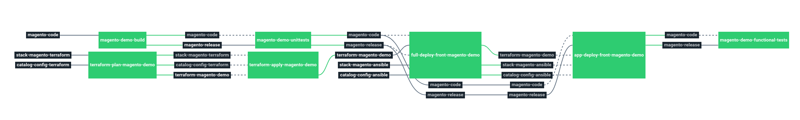

# Stack-magento

Service catalog magento stack

This stack will deploy a Magento on X Amazon EC2 instances behind an ELB load balancer, using RDS database and ElasticCache. 


# Architecture

<p align="center">

</p>

  * **ELB**: Amazon Elastic Load Balancing
  * **EC2** Amazon Elastic Compute Cloud
  * **RDS** Amazon Relational Database Service
  * **Cache** Amazon ElastiCache Redis

# Requirements

In order to run this task, couple elements are required within the infrastructure:

  * Having a VPC with private & public subnets [here](https://docs.aws.amazon.com/vpc/latest/userguide/getting-started-ipv4.html#getting-started-create-vpc)
  * Having a bastion server to run Ansible like described [here](https://docs.cycloid.io/advanced-guide/ansible-integration.html#standard-usage)
  * Having an S3 bucket to store Terraform remote states [here](https://docs.aws.amazon.com/quickstarts/latest/s3backup/step-1-create-bucket.html)
  * Having an S3 bucket for Magento code **WITH** versioning enable [here](https://docs.aws.amazon.com/quickstarts/latest/s3backup/step-1-create-bucket.html)

# Details

## Pipeline

> **Note** The pipeline contains a manual approval between terraform plan and terraform apply.
> That means if you trigger a terraform plan, to apply it, you have to go on terraform apply job
> and click on the `+` button to trigger it.

<p align="center">

</p>

**Jobs description**

  * `build`: Runs the appropriate `php/composer` commands to build the Magento code.
  * `unittest`: Dummy job meant to eventually be replaced by proper tests or removed.
  * `full-deploy-front`: Ansible job that will fully install the EC2 instances, users, config, etc.
  * `app-deploy-front`: Ansible job meant to only deploy the Magento code in case of deployment.
  * `functional-test`: Same as unittest, that's a dummy job to eventually ensure everything is working as expected following the deployment.
  * `terraform-plan`: Terraform job that will simply make a plan of the stack.
  * `terraform-apply`: Terraform job similar to the plan one, but will actually create/update everything that needs to. Please see the plan diff for a better understanding.
  * `terraform-destroy`: :warning: Terraform job meant to destroy the whole stack - **NO CONFIRMATION ASKED**. If triggered, the full project **WILL** be destroyed. Use with caution.

**Params**

|Name|Description|Type|Default|Required|
|---|---|:---:|:---:|:---:|
|`ansible_vault_password`|Password used by ansible vault to decrypt your vaulted files.|`-`|`((raw_ansible_vault_password))`|`True`|
|`aws_access_key`|Amazon AWS access key for Terraform. see value format [Here](https://docs.cycloid.io/advanced-guide/integrate-and-use-cycloid-credentials-manager.html#vault-in-the-pipeline)|`-`|`((aws.access_key))`|`True`|
|`aws_default_region`|Amazon AWS region to use for Terraform.|`-`|`eu-west-1`|`True`|
|`aws_secret_key`|Amazon AWS secret key for Terraform. see value format [Here](https://docs.cycloid.io/advanced-guide/integrate-and-use-cycloid-credentials-manager.html#vault-in-the-pipeline)|`-`|`((aws.secret_key))`|`True`|
|`bastion_private_key_pair`|bastion SSH private key used by ansible to connect on aws ec2 instances and the bastion itself.|`-`|`((ssh_bastion.ssh_key))`|`True`|
|`bastion_url`|bastion url used by ansible to connect on aws ec2 instances.|`-`|`admin@bastion.cycloid.io`|`True`|
|`config_ansible_path`|Path of Ansible files in the config git repository|`-`|`($ project $)/ansible`|`True`|
|`config_git_private_key`|SSH key pair to fetch the config git repository.|`-`|`((git_config.ssh_key))`|`True`|
|`config_git_repository`|Branch of the config git repository.|`-`|`master`|`True`|
|`config_terraform_path`|Path of Terraform files in the config git repository|`-`|`($ project $)/terraform/($ environment $)`|`True`|
|`customer`|Name of the Cycloid Organization, used as customer variable name.|`-`|`($ organization_canonical $)`|`True`|
|`env`|Name of the project's environment.|`-`|`($ environment $)`|`True`|
|`magento_deploy_bucket_name`|AWS S3 bucket name in which store the builded code of magento.|`-`|`($ project $)-deploy`|`True`|
|`magento_deploy_bucket_object_path`|AWS S3 bucket path in which store the builded code of magento.|`-`|`/catalog-magento/($ environment $)/magento.tar.gz`|`True`|
|`magento_git_branch`|Branch of the magento source code git repository.|`-`|`master`|`True`|
|`magento_git_private_key`|SSH key pair to fetch magento source code git repository.|`-`|`((git_magento.ssh_key))`|`True`|
|`magento_git_repository`|Url to the git repository containing Magento source code.|`-`|`git@github.com:MyUser/code-magento.git`|`True`|
|`project`|Name of the project.|`-`|`($ project $)`|`True`|
|`stack_git_branch`|Branch to use on the public stack git repository|`-`|`master`|`True`|
|`terraform_storage_bucket_name`|AWS S3 bucket name to store terraform remote state file.|`-`|`($ organization_canonical $)-terraform-remote-state`|`True`|
|`terraform_storage_bucket_path`|AWS S3 bucket path to store terraform remote state file.|`-`|`($ project $)/($ environment $)`|`True`|

## Terraform

**Inputs**

|Name|Description|Type|Default|Required|
|---|---|:---:|:---:|:---:|
|`bastion_sg_allow`|Amazon source security group ID which will be allowed to connect on Magento front port 22 (ssh).|`-`|``|`False`|
|`cache_subnet`|AWS elasticache subnet name.|`-`|`Automatically generated from private_subnets_ids`|`False`|
|`elasticache_engine`|AWS elasticache binding port.|`-`|`6379`|`False`|
|`elasticache_nodes`|Number of AWS elasticache instances.|`-`|`1`|`False`|
|`elasticache_parameter_group_name`|AWS elasticache parameter group name.|`-`|`default.redis3.2`|`False`|
|`elasticache_type`|AWS elasticache instance type.|`-`|`cache.t2.micro`|`False`|
|`front_count`|Number of Aws EC2 frontend server to create.|`-`|`1`|`False`|
|`front_disk_size`|Disk size in Go of Aws EC2 frontend servers.|`-`|`60`|`False`|
|`front_ebs_optimized`|Whether the Instance is EBS optimized or not, related to the instance type you choose.|`bool`|`false`|`False`|
|`front_type`|Type of Aws EC2 frontend servers.|`-`|`t3.small`|`False`|
|`keypair_name`|SSH keypair name to use to deploy ec2 instances.|`-`|`demo`|`False`|
|`magento_ssl_cert`|ARN of an Amazon certificate from Certificate Manager.|`-`|``|`True`|
|`private_subnets_ids`|Amazon subnets IDs on which create each components.|`array`|``|`True`|
|`public_subnets_ids`|Public subnet IDs to use for the public ELB load balancer.|`array`|``|`True`|
|`rds_backup_retention`|RDS backup retention period in days.|`-`|`7`|`False`|
|`rds_database`|Name of the RDS database.|`-`|`magento`|`False`|
|`rds_disk_size`|Sice in Go of the RDS database.|`-`|`10`|`False`|
|`rds_engine`|Amazon RDS engine to use.|`-`|`mysql`|`False`|
|`rds_engine_version`|Version of the RDS engine.|`-`|`"5.7.16"`|`False`|
|`rds_multiaz`|Enable multi AZ or not for the RDS database.|`bool`|`false`|`False`|
|`rds_parameters`|RDS parameters to assign to the RDS database.|`-`|``|`False`|
|`rds_password`|Password of the RDS database.|`-`|`ChangeMePls`|`False`|
|`rds_subnet`|ID of the private DB subnet group to use for RDS database.|`-`|`Automatically generated from private_subnets_ids`|`False`|
|`rds_type`|AWS Instance type of the RDS database.|`-`|`db.t2.small`|`False`|
|`rds_username`|User name of the RDS database.|`-`|`magento`|`False`|
|`vpc_id`|Amazon VPC id on which create each components.|`-`|``|`True`|


**Outputs**

| Name | Description |
|------|-------------|
| cache_address | Address of the elasticache. |
| elb_front_dns_name | DNS name of the front elb. |
| elb_front_zone_id | Zone ID of the front elb. |
| front_private_ips | Private IPs of the front EC2 server. |
| rds_address | Address of the RDS database. |
| rds_database | Database name of the RDS database. |
| rds_port | Port of the RDS database. |
| rds_username | Username of the RDS database. |

## Ansible

|Name|Description|Type|Default|Required|
|---|---|:---:|:---:|:---:|
|`magento_admin_email`|Magento install option admin-email|`-`|`root@localhost.local`|`False`|
|`magento_admin_firstname`|Magento install option admin-firstname|`-`|`admin`|`False`|
|`magento_admin_lastname`|Magento install option admin-lastname|`-`|`admin`|`False`|
|`magento_admin_password`|Magento install option admin-password|`-`|`4Bigs3cr3t`|`False`|
|`magento_admin_user`|Magento install option admin-user|`-`|`admin`|`False`|
|`magento_backend_frontname`|Magento frontName to use in env.php|`-`|`admin`|`False`|

# Troubleshooting

# Molecule tests

(Add it if there is ansible + molecule test we can run)

Requires a bucket which contains a build of magento sources and AWS accesskey

```
export AWS_SECRET_ACCESS_KEY=$(vault read -field=secret_key secret/$CUSTOMER/aws)
export AWS_ACCESS_KEY_ID=$(vault read -field=access_key secret/$CUSTOMER/aws)

export MAGENTO_DEPLOY_BUCKET_NAME=cycloid-deploy
export MAGENTO_DEPLOY_BUCKET_OBJECT_PATH=/catalog-magento/ci/magento.tar.gz
export MAGENTO_DEPLOY_BUCKET_REGION=eu-west-1

# Share if needed your ssh key to an ssh agent (used by molecule to clone dependencies)
eval $(ssh-agent )
ssh-add ~/.ssh/id_rsa

# Run molecule
molecule test
```
